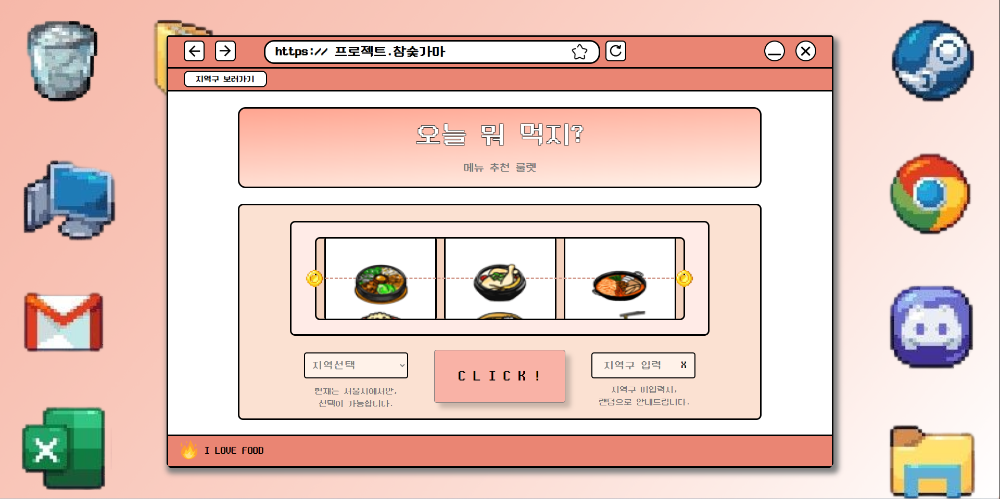
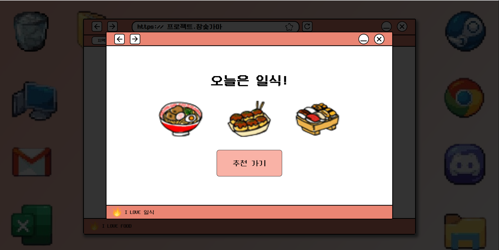
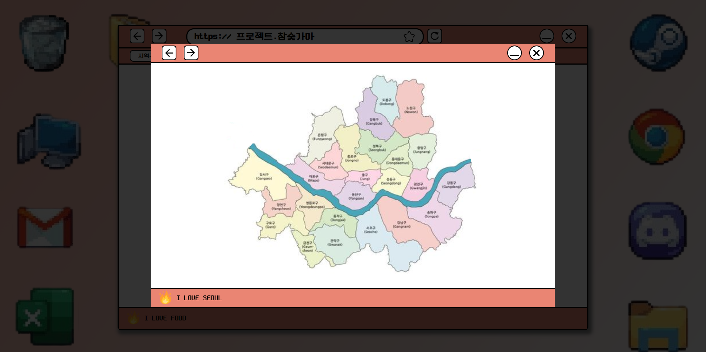
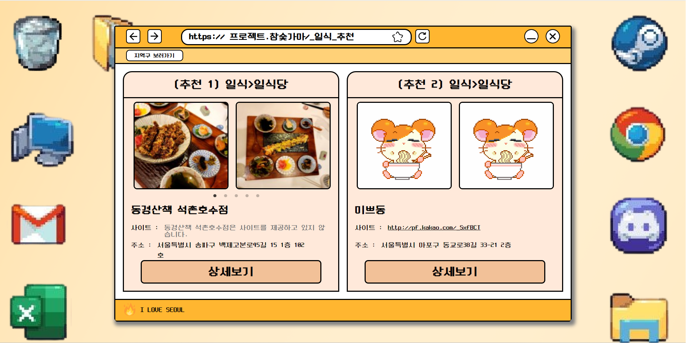
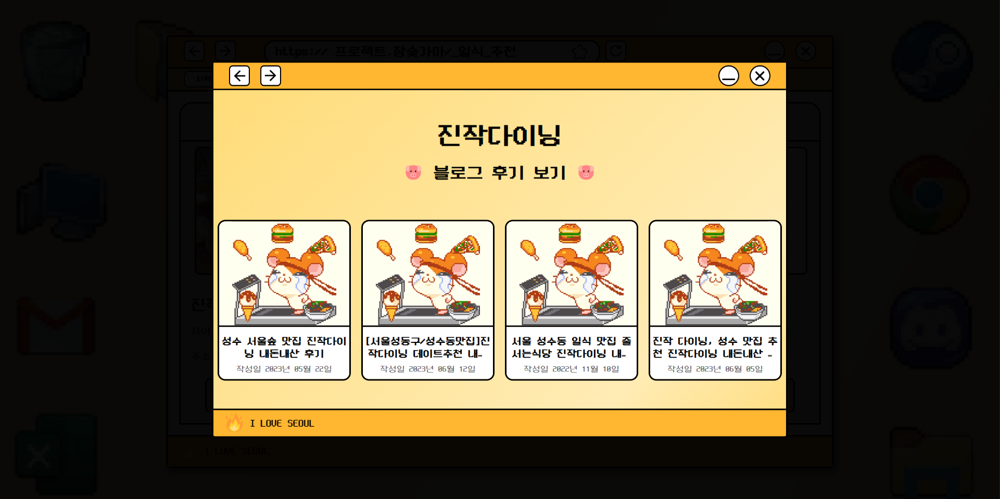
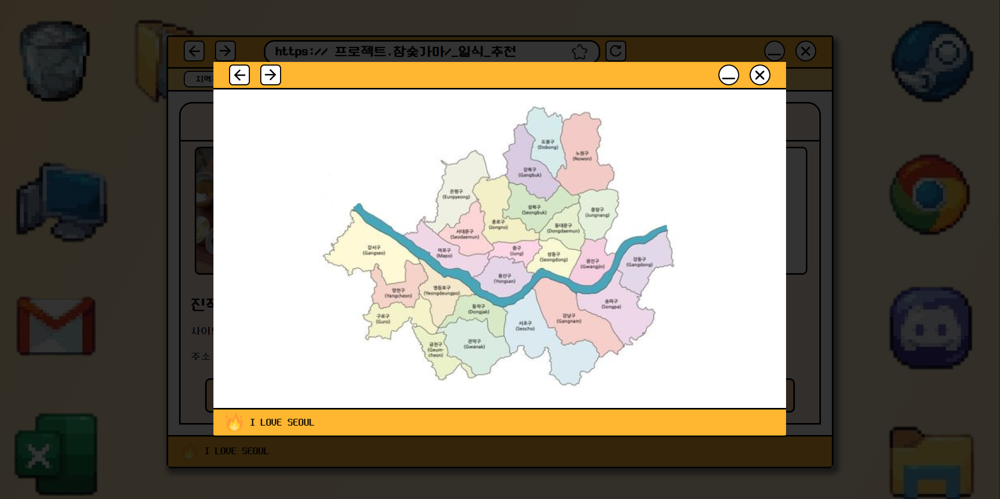

 

## Project. 메뉴 추천 룰렛
>**[코드스테이츠 FE 45기] 스터디_참숯가마**  
>**개발기간 : 2023.6.23 ~ 2023.07.15**

 

## 프로젝트 미리보기

 

 

## 프로젝트 팀 소개
|이 원호|윤 예빈|
|---|---|
|||

# Project. 식사

 

## 프로젝트 기획
### 컴포넌트
---------------------------------

 
 

### 프로젝트 계획한 이유
-----------------------------
**서울 25개구 지역을 바탕으로 점심 메뉴 추천을 해주는 랜덤 룰렛.**
선택이 어렵다면 점.메.추 룰렛! 추천 드립니다.

 

게임처럼 재밌게 점심메뉴를 골라드립니다!

오늘은 뭘 먹어야 할지 고민이라면? 
늘 먹는 음식이 정해져있다면? 
색다른 음식이 먹고 싶다면? 

점.메.추 룰렛 추천 드립니다.

 

### 점.메.추 룰렛 사용방법
----------------------------
1. 원하는 지역구를 입력해주세요.
2. 지역구를 모르신다면 우측 상단 지역구 보기를 클릭.
3. 지역구를 입력하셨다면, **룰렛 START!**
4. 룰렛에 결과에 따라 알맞은 메뉴를 추천해 드립니다.
5. 결과 보러가기 Go Go!
6. 선택하신 지역에 식당을 추천해 드립니다.
7. 자세히 보고 싶다면 상세보기를 클릭.
8. 음식 메뉴를 클릭하면 음식에 대한 상세한 내용도 볼 수 있습니다.

 

### 구현 기능

 

### 사용한 폰트

